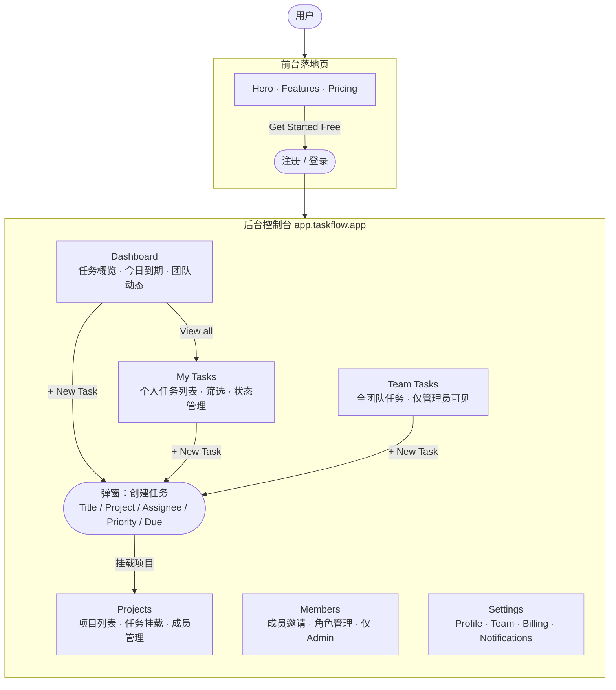

# TaskFlow 主体功能流程文档

> **说明**：本文档为测试用途虚构产品，模拟一个轻量级团队任务管理 SaaS。

---

## 产品整体架构

| 界面 | 访问路径 | 用途 |
|------|---------|------|
| **前台落地页** | taskflow.app/ | 产品介绍、注册引导 |
| **后台控制台** | app.taskflow.app/ | 团队任务管理核心功能 |

> **计费单位**：USD，按月/年订阅。

---

## 一、后台控制台

### 导航菜单结构

```
Dashboard
Tasks
  └─ My Tasks
  └─ Team Tasks
Projects
Members
Settings
```

---

### 1.1 Dashboard

**定位**：登录后的主仪表盘，展示任务概览和团队动态。

#### 数据卡片区

| 字段 | 说明 |
|------|------|
| My Open Tasks | 当前用户未完成任务数 |
| Due Today | 今日到期任务数 |
| Team Activity | 团队今日操作次数 |
| Completed This Week | 本周已完成任务数 |

**操作按钮**：+ New Task（快速创建） / View All Tasks（跳转 Tasks 页）

#### 最近任务列表

- 展示最近 5 条任务（含状态标签）
- 「View all」跳转至 Tasks > My Tasks

---

### 1.2 Tasks — My Tasks

**定位**：当前用户的个人任务列表。

筛选条件：状态下拉（All / Open / In Progress / Done）/ 优先级下拉 / 日期范围 / 重置

#### 任务列表字段

| 字段 | 说明 |
|------|------|
| Title | 任务标题，可点击进入详情 |
| Project | 所属项目标签 |
| Priority | High / Medium / Low，颜色区分 |
| Assignee | 指派人头像 |
| Due Date | 到期日期，逾期红色高亮 |
| Status | Open / In Progress / Done / Cancelled |
| Actions | Edit / Delete |

操作入口：「+ New Task」按钮 → 创建任务弹窗

---

### 1.3 Tasks — Team Tasks

**定位**：团队所有成员的任务汇总视图，仅 Admin 和 Manager 可见。

与 My Tasks 字段相同，额外增加：

| 字段 | 说明 |
|------|------|
| Assignee | 展示具体成员名称 |
| Created By | 任务创建人 |

---

### 1.4 创建任务弹窗（New Task Modal）

| 字段 | 说明 |
|------|------|
| Title | 必填，文字输入 |
| Description | 富文本，可选 |
| Project | 下拉选择已有项目 |
| Assignee | 下拉选择团队成员，默认自己 |
| Priority | High / Medium / Low，默认 Medium |
| Due Date | 日期选择器，可选 |
| Status | 默认 Open |

操作：Cancel / Create Task

---

### 1.5 Projects

**定位**：管理团队项目，任务可挂载到项目下。

#### 项目列表字段

| 字段 | 说明 |
|------|------|
| Name | 项目名称，可点击进入项目详情 |
| Tasks | 该项目任务总数 / 已完成数 |
| Members | 项目成员头像组（最多显示5个） |
| Status | Active / Archived |
| Created | 创建日期 |
| Actions | Edit / Archive / Delete |

操作入口：「+ New Project」按钮

---

### 1.6 Members

**定位**：团队成员管理，仅 Admin 可操作。

#### 成员列表字段

| 字段 | 说明 |
|------|------|
| Name | 成员姓名 |
| Email | 邮箱 |
| Role | Admin / Manager / Member |
| Status | Active / Invited / Suspended |
| Joined | 加入日期 |
| Actions | Change Role / Suspend / Remove |

操作入口：「Invite Member」按钮 → 输入邮箱发送邀请

---

### 1.7 Settings

**定位**：团队和个人设置。

子菜单：
- **Profile** — 修改姓名、头像、密码
- **Team** — 团队名称、Logo、时区
- **Billing** — 订阅套餐、账单历史、付款方式
- **Notifications** — 邮件通知开关（任务指派 / 到期提醒 / 评论）

---

## 二、前台落地页

### 主要模块

| 模块 | 内容 |
|------|------|
| Hero | 一句话口号 + CTA「Get Started Free」|
| Features | 3个核心功能介绍（任务管理、团队协作、项目追踪）|
| Pricing | Free / Pro $12/mo / Team $29/mo |
| Testimonials | 用户评价 |
| Footer | 链接（Docs / Blog / Privacy）|

---

## 三、产品导航流程图


