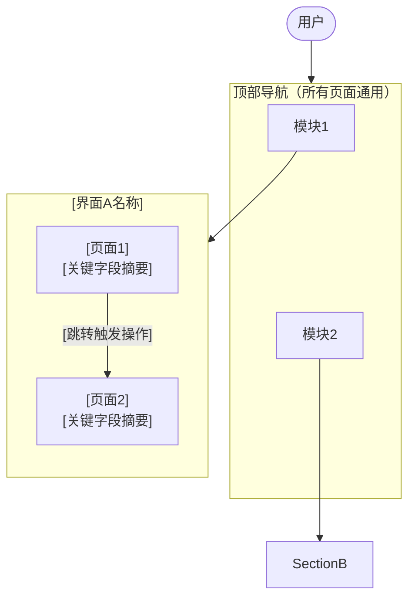

# 功能流程文档 — 格式规范

> 参考文件：`工作/cogfoundry/参考/胜算云功能流程文档.md`
> 本模板说明如何撰写功能流程文档。内容以「产品现状调研」为目标，侧重用户视角的 UI 结构与交互流程。

---

## Frontmatter

```yaml
---
type: design-audit
title: [产品名]主体功能流程文档
product: [产品名]
date: [YYYY-MM-DD]
调研人: daf
source: "[调研来源，如网站截图、WebFetch 等]"
---
```

---

## 文档结构

### 1. 产品整体架构

用表格描述产品有哪些独立界面/入口：

| 界面 | 品牌/标识 | 访问路径 | 用途 |
|------|---------|---------|------|
| 管理后台 | xxx Logo + Sidebar | 顶部导航「控制台」 | 账户管理、余额... |
| 前端展示层 | xxx Logo | 顶部导航「模型中心」 | 公开浏览... |

> 说明货币单位、语言、用户类型等基础信息

---

### 2. 各界面详细说明

每个界面单独一个 `## 一、[界面名]` 章节，下分各页面子章节。

#### 页面子章节格式

```markdown
### [序号] [页面名]

**定位**：[一句话说明这个页面是干嘛的]

#### [模块名]

[用表格描述字段]

| 字段 | 说明 |
|------|------|
| 字段名 | 说明 |

[有流程的用有序列表]

1. 步骤一
2. 步骤二

[有筛选条件的单独说明]

筛选条件：[条件1] / [条件2] / 重置 / 查询

[有操作按钮的说明入口与跳转]

操作按钮：「主要操作」→ [跳转目标]
```

**未覆盖的页面**：
```markdown
### [序号] [页面名]

> 待补充（调研未覆盖）
> 子菜单：[子菜单项]（如已知）
```

---

### 3. 产品导航流程图

用 Mermaid flowchart 描述页面间的跳转关系：

````markdown

````

---

## 写作要点

1. **字段优先**：每个页面尽量列出所有可见字段，即使是次要字段
2. **状态标注**：有多个状态值的字段，列出所有枚举（如：成功/失败、待处理/进行中/已完成）
3. **空状态**：记录无数据时的展示文案（如「还没有模型」「暂无记录」）
4. **操作入口**：Button 和链接都要记录，及其跳转目标
5. **模糊处理**：调研时无法确认的内容，用「待补充」标注，不要臆造

---

## 示例片段

```markdown
### 1.2 充值页

**定位**：账户充值，选择套餐或自定义金额，完成支付。

#### 顶部余额概览

| 字段 | 当前示例值 |
|------|----------|
| 总余额 | $30.00 |
| 已购余额 | $30.00 |
| 赠送余额 | $1.50 |

#### 充值套餐

**固定套餐**（4档）：

| Credits | 售价 | 赠送 |
|---------|------|------|
| $10 | $10 | — |
| $30 | $30 | +$1.5 bonus |

**自定义金额**：$10 ～ $1,500，超出引导联系销售

#### 支付方式

支付方式：Credit Card（via Stripe）/ PayPal / Wire Transfer（≥$500）/ Enterprise

充值流程：选择金额 → 选择支付方式 → 完成支付 → 余额更新
```
